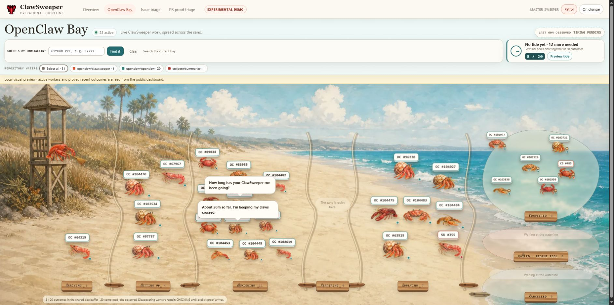

# OpenClaw Bay

- Status: active public observer guide
- Owner: ClawSweeper maintainers
- Source of truth: `dashboard/bay-page.ts`, public Worker and queue projectors,
  Bay tests, and the read-only `/bay` route
- Last verified: 2026-09-04, with baseline
  `openclaw/clawsweeper@ea976d0cda362d3547f0058f25174f6a1c97ff18`; the lifecycle
  inventory follow-up's exact tested revision and native/browser evidence are
  recorded in its pull request
- Update when: lane names, stage mapping, public projection or completeness
  rules, private-state ownership, routes, or navigation changes

OpenClaw Bay is a public, indexable, read-only visualisation of the live
ClawSweeper pipeline. It lives at `/bay` on the existing dashboard Worker and
turns bounded activity into animated rows moving across a shoreline. The count
maps remain the authoritative pipeline view. A bounded card sample may also
show a canonical repository and issue or pull-request number when the
repository is on the deployment's verified-public allowlist. It is linked from
the Overview, issue-triage, and PR-proof headers as a normal ClawSweeper
web-page destination.

The page reads top to bottom: a compact header with activity/freshness, last-hour
review timing, an independent inline-proof timing selector and an always-visible
chart (or an explicit unavailable state); then the shoreline toolbar with finder,
repository and review-path selection. Appearance-only View options contains
motion, sweeper movement and tide preview. Below is the illustrated beach, the durable lifecycle board, the collapsed queue telemetry
disclosure, and a footer.

Bay is an observer-only surface: it displays bounded public status and may
provide view-only navigation to verified-public GitHub repository, item,
workflow-run, and job pages. Those canonical GET links are references, not
action controls. Bay never calls GitHub from the browser or triggers or offers
queue, workflow, GitHub, DLQ, recovery, deploy, rollback, or other mutation
controls. Its public visibility is not an authorization boundary; any future
restricted surface would require separate authentication or access-control
design.

## Historical Review Artifact



[Watch the 32-second browser recording](openclaw-bay-demo.mp4). It shows the
historical shoreline, movement between lanes, and terminal pools from the
earlier review-time UI. It does not describe or prove the current bounded
public-reference contract. The recording is a 1280×720 H.264 review artifact with
audio and capture metadata removed.

The lightweight records under `docs/proof/openclaw-bay` describe historical
review-time evidence. The full-resolution trace and storyboard introduced in
commit `1a5becc69fc1bdbc11e16aa22f5caaa44f05a59d` have been pruned from the docs
tree and remain available in git history. The package's recorded source
identifier, `0cf6b147fe86f56e4ec8c77352e3d31433e3a1d2`, is not reachable from current
repository history, so neither the records nor archived media are current
proof. Current pull requests must publish exact-head proof and provenance in
the PR body. The historical run used the real page and artwork with a fully
synthetic, redacted status sequence and made no live dashboard reads.

## What It Shows

Bay uses one closed set of six active stages:

- Arriving
- Setting up
- Reviewing
- Publishing
- Applying & writing
- Repair & attention

Each complete public activity snapshot contains exactly those six queue counts,
the same six live counts, and a total equal to their sum. Counts are bounded
non-negative integers; extra stage names and unexpected fields are discarded.
The Worker privately correlates queue and live state long enough to subtract
active overlaps from the queue counts. It drops that correlation material
before serialization, so the two public maps are disjoint without publishing a
join key.

The Repair & attention area retains the existing `repairing` stage identifier.
It distinguishes stopped review records requiring operator attention, scheduled
review retries, and live repair activity; its aggregate is not a count of running
code repairs. Review cards and their detail blades use only observed, closed
failure categories. Legacy records without stored cause say the detailed
historical reason is unavailable, rather than guessing from retry exhaustion.

The page draws the bounded verified-public reference sample as cards. Each card
contains only a canonical `owner/repository`, positive issue or pull-request
number, closed Bay stage, and closed queue/live source. The browser constructs
the canonical GitHub issue URL from those fields; GitHub resolves pull-request
numbers on that route. Clicking a referenced card opens a local detail blade
with the closed stage and source plus canonical links to the repository and
issue or pull request. When the action belongs to a verified-public repository,
the blade also reconstructs canonical run and job links and shows a closed step
timeline: fixed step categories, completed steps in green, and the current step
in orange. Raw workflow and step names never enter the public projection.
Repository filters and the finder accept an item number or
`owner/repository#number`. They search only the current bounded sample and do
not call GitHub. Press `/` outside form controls to focus the finder. The
shortcut stays inactive while a detail blade is open. The `+N sampled items` / View list control opens every available record in that
area’s bounded sample, including drawn records, in the existing read-only blade.
Aggregate totals, sampled records and drawn slots are reported separately. The
list is not the backlog and cannot retrieve unsampled identities.

The finder is compact and left-aligned beside its actions and filters. Cards
use deterministic, key-seeded offsets within nonoverlapping cells rather than
perfect rows. Desktop lanes borrow spare width from quieter areas; crowded
areas show up to 20 sampled creatures with compact number labels and 44px-or-larger
hit targets. Hover, keyboard focus and finder expand the creature and readable
identity above its neighbors without repacking; touch opens the same inspector.
Active scenes grow vertically when needed rather than silently dropping back to
eight cards. Records beyond 20 remain in the read-only list and finder. Resizing, filtering or changed sample
membership may rearrange cards; repeating an unchanged snapshot does not.
Labels show the short repository name and item number on separate lines, with
full owner/repository identity in the inspector. All available sample records
remain reachable through the area list when the beach cannot fit them.
Below 1200px, the stage picker and Previous/Next controls cover the six stages
in source order, followed by Completed and Failed / cancelled. Initial selection
prefers the first populated area; an explicit selection survives refresh and
resize, including empty areas. Page scrolling remains vertical. Native modal
dialogs retain keyboard containment, Escape dismissal and semantic focus return.

**All review paths** is the operational default so active batch publication
fallback remains visible. **Direct-review paths only** uses the existing
`legacy_batch_path` classification, which combines batch/artifact/shard/history
heuristics; the field name does not mean that batch publication is retired or
that these records are old. It is not proof-use provenance. This selector affects
both the beach and timing population; repository filtering affects only the
beach, and inline-proof cohort selection remains independent. No backend
publication behavior changes with these controls.

The reference exception is intentionally narrow. Verified-public repository,
issue or pull-request numbers, GitHub run and job identifiers, a validated
action start timestamp, and closed action/step categories are allowed. The
browser constructs links from those fields. Workflow titles, item titles, raw
step names, source URLs, query strings, raw failure payloads, failure keys,
credentials, tokens, internal queue keys, and repositories outside
`PUBLIC_BAY_REPOS` remain excluded. Invalid configuration yields no public
references. Malformed or over-cap samples fail closed without weakening the
aggregate counts.

Completed, failed, and cancelled pools contain explicitly observed terminal
outcomes. A terminal card carries the same verified-public repository and item
reference, and its closed action timeline when available; otherwise it remains
count-only. A
disappearing worker is never treated as successful. Because completed-job
evidence can trail the active feed, an unconfirmed disappearance remains in the
checking state for up to 150 seconds and enters a terminal pool only after
explicit outcome evidence arrives.

The terminal buffer is deliberately small. At 20 proved outcomes, the tide
animation clears the visible pools. Private Bay state retains fewer than 20
buffered outcomes, the most recent 20 washed outcomes, and at most 256
deduplication entries under the existing seven-day event TTL. The public
projector retains only bounded tide values, closed outcome categories, and safe
timestamps. The Preview tide button changes only the browser animation and does
not mutate stored state.

The exact-review control board is secondary operator context under the closed
`Queue telemetry` disclosure. Expanding it separates review admission from
result publication and shows aggregate lane totals, bounded 6-hour, 24-hour,
or 7-day history, and closed observed cause counts. The crab lanes remain the
primary pipeline visualization. The control board does not infer an upstream
reason for a cancellation or failure and exposes no queue, recovery, deploy,
or rollback controls.

The collapsed **Retained lifecycle records** disclosure below queue telemetry
contains three inventory counts and six closed lifecycle-lane counts: pending, acknowledgement pending, completed, superseded,
requeued, and terminal attention. A complete projection may include at most 24
cards drawn only from `PUBLIC_BAY_REPOS`. Each card contains the canonical
repository and issue or pull-request number, a closed lane/state, a current
revision boolean, and a canonical timestamp. The browser constructs the GitHub
item link. Revision identifiers, target keys, facts, titles, raw URLs, and
failure detail remain private. Historical growth does not cap the inventory:
the store counts identities in SQL and streams every selected repository row
through the lifecycle validator and reducer in one synchronous read transaction.
It retains at most 24 candidate cards per lane, skips sorting candidates that
cannot enter a full sample, and resolves current revisions only for the final
24-card sample. Equal-ranked candidates preserve their original order.
Validation still costs a linear scan of that
history; it does not retain a history-sized JavaScript array or identity set.
An invalid historical row makes the whole projection unavailable even when it
would not appear in the sample. Reads never prune or rewrite durable facts.
Counts cover all retained records in the public repository scope, with no date
filter: latest recorded state, not live backlog or cumulative event totals.
Records are keyed by target, fence and revision; target revisions deduplicate
target and revision; unique targets are repository/item identities. Beach and
time filters do not affect this disclosure. The 24 cards sample across lanes,
not in proportion to their totals. Retained does not establish all-time coverage.

The top duration chart uses a zero-based minutes Y-axis and a fixed rolling
last-hour X-axis in UTC anchored to `bay.timings.window_ended_at`, captured
by the same query that computes the timing aggregate. It does not use the
browser clock or the earlier outer status-collection timestamp. Stale
status snapshots are labeled and missing timing-window timestamps
make the chart unavailable rather than shifting the data. One plot-wide focusable
slider reveals interval, median, mean and sample count in a compact floating
tooltip. Hover or scrub across the plot, tap/drag on touch, or use arrow keys and
Home/End on the keyboard; Escape dismisses details. There is no chart interval
dropdown or permanent detail panel. The separate inline-proof cohort selector
remains. Valid refresh preserves the navigation node, focus and logical interval;
unavailable data removes stale chart interaction and returns focus to status.
Missing buckets are hatched gaps, never zero-duration samples; partial hour-edge
buckets are labeled.
The existing API returns at most 12 aligned five-minute buckets, so a rolling
hour that intersects 13 can have an unrepresented edge bucket. This remains
explicitly missing rather than being inferred from the overall aggregate.

The public lifecycle response is cached for up to 20 seconds in Cloudflare's
native, per-data-center cache, scoped to the verified public repository set.
Cache hits keep the original observation time and never extend the 60-second
snapshot freshness limit. Cache failures fall back to a fresh read; expired
successes are not served when that read fails. This reduces repeat scans from
viewers, but cold reads still validate the full history and simultaneous misses
or requests in different data centers can each require a scan.

Queue completion preserves a previously committed final lifecycle outcome when
a later callback reports a different final result. Explicit requeue transitions
remain available, and a requeued revision can acquire its next terminal outcome.
The lifecycle store still rejects conflicting direct terminal writes; completion
and acknowledgement drivers use the committed outcome as their authority.

## Completeness And Private State

Combined queue/live activity is published only when the queue projection, the
active-worker census, and their closed schemas are complete. An incomplete or
over-cap worker census, a stale snapshot, malformed nested data, or an unsafe
legacy cache shape yields an unknown aggregate: `activity.complete` is false
and the queue map, live map, and total are unavailable. Bay does not substitute
a partial count or recover detail from an unbounded field. Fresh responses,
cached responses, and restart or legacy paths all pass through the same
fail-closed public projection.

The ExactReviewQueue Durable Object may retain the internal metadata required
for ownership, deduplication, retries, and restart recovery. That state is
binding-only and is not itself a public response. Before the Worker serves the
durable lifecycle view, it validates the complete private shape and creates a
new fixed aggregate object. Unknown, stale, malformed, mixed, or over-cap state
produces an unavailable projection with no inventory, lane, or sample payload.
This boundary preserves useful private operations state without making it a
public or cache-serializable identity surface.

## Inline Proof Timing Comparison

The last-hour timing control defaults to all reviews in the selected publication-path
view. It can compare **inline proof requested**, **no inline proof requested (known)**,
and **inline proof unknown**. These are full request-to-final durations: inline
proof time is already included and is never subtracted. The Review paths
selector remains independent; repository filters affect the beach, not this metric.

“Requested” means the original review lease successfully admitted at least one
inline-proof request. It does not mean a producer ran, evidence returned, a check
passed, or a reviewer judged proof sufficient. A bounded durable enum belongs to
the admitted review revision and survives lease cleanup and retries. A new head
or admission revision does not inherit it. Linked publication timing follows only
the exact producer fence/revision and completed claim generation; missing, stale,
cancelled, or command-mismatched lineage remains unknown. No plans, observations, request IDs,
lease capabilities, or credentials are exposed.

“No request” is known only when tracking began at original admission. Historical,
reconstructed, missing, and malformed participation remains unknown rather than
being inferred from command wording, selected scenarios, or the legacy batch flag.
The timing population is still the existing bounded last-hour final-receipt set;
missing cohort data does not invalidate the all-reviews metric or invent a no-proof
cohort. Lifecycle cards display the same closed participation fact (while pending,
“not requested yet”). Each selected cohort reports its own sample count, median,
mean, and history.

This additive contract was exercised on September 7, 2026 using the local Worker,
SQLite Durable Object and Chromium fixture in
[`proof/bay-inline-proof`](proof/bay-inline-proof/README.md). Exact-head evidence
belongs in the accompanying PR body; this fixture does not exercise live producers.

## Data And GitHub API Load

Bay is a presentation over the cache-backed public `/api/status` snapshot and
the bounded `/api/durable-lifecycle-bay` projection. It adds no
browser-to-GitHub requests and no new GitHub REST or GraphQL query path. Active
stage counts, the bounded verified-public reference sample, explicit terminal
outcomes, and observed completion timing are derived from data already
collected for the Overview page. Overview uses the same projected reference
sample for its public-work cards, search, and equivalent public-reference
blade. Private correlation fields used during collection are not part of
either rendered surface or blade. A sampled queue reference may expose only a
validated queue-start timestamp; a sampled live reference may expose only its
validated public GitHub action-start timestamp. Active crustaceans label these
clocks explicitly as `Queued` or `Run`, and crab chat uses the same distinction.
If neither source is available, Bay says that active timing is unavailable
instead of guessing.

Bay polls the Worker every 20 seconds, compared with Overview every 15 seconds:
three rather than four browser status requests per minute after initial load.
That is 25% fewer requests to the Worker, not a claim of 25% fewer GitHub API
calls. The existing 20-second server cache, snapshot age, edge location, and
other viewers determine when either page causes a GitHub refresh. In
particular, Bay's 20-second timer can align with cache expiry, so Bay does not
claim a lower upstream GitHub refresh rate than Overview.

The queue's dedicated public projection owns its closed reason counters and
publication policy through every status cache read. This keeps a valid parked
review from making the entire shoreline unavailable. The controlled
[cache-reprojection proof](proof/bay-live-status/README.md) reproduces the old
failure and verifies populated status after repeated stored reads. The header
separates current activity from review timing, and opaque lane labels keep the
counts readable against the illustrated beach.

The displayed end-to-end timing is an observed sample of the latest completed
jobs found in the previous hour, not a complete one-hour census. Queue age and
live-run age are not presented as time spent in the current visual lane;
per-lane transition timing remains unavailable.

## Assets And Deployment

The page, status API, and image assets all belong to `openclaw/clawsweeper`:

- `dashboard/bay-page.ts` renders the page.
- `dashboard/worker.ts` serves `/bay`, permanently redirects legacy `/bay-demo`
  bookmarks, and derives the bounded Bay state.
- `dashboard/public/bay-assets/` contains the three WebP assets.
- `dashboard/wrangler.toml` binds that public asset directory.
- `.github/workflows/dashboard.yml` deploys the existing
  `clawsweeper-status` Worker to `clawsweeper.openclaw.ai`.

The Bay HTML is `no-store` and protected by a content security policy. Its
`frame-ancestors https://team.openclaw.ai` policy permits embedding in the Team
dashboard and blocks other parent origins. It deliberately omits
`X-Frame-Options`, which cannot express this cross-origin allowlist. Standalone
navigation remains available. `/bay` is the single canonical public route;
`/bay-demo` is retained only as a permanent redirect to the query-free canonical
route.

The dashboard owner maintains this policy in `dashboard/worker.ts` and verifies
it during deployment with `scripts/dashboard-smoke.mjs`. When changing allowed
parents or Bay navigation, run `node scripts/proof-bay-embedding.mjs` in a
browser-equipped validation environment. Set `PLAYWRIGHT_CHROMIUM_EXECUTABLE`
to its Chromium binary if needed. This proof uses the real Worker responses
and synthetic parents to exercise Overview-to-Bay iframe navigation, blocked
origins, and standalone access; its JSON and screenshot artifacts are written
to `.artifacts/bay-team-embedding/`. Telemetry is deliberately unavailable in
this focused proof. The active embedding contract was verified on 2026-09-13;
the proof receipt records the source revision and Worker hash.

## Local Proof

Start the Worker:

```bash
pnpm run dashboard:dev
```

Then open <http://127.0.0.1:8787/bay>. When local GitHub telemetry is
unavailable, the localhost page may read the existing public, cache-backed
production status snapshot for visual proof. The hosted page remains
same-origin in its request behavior; the CSP allows only self and OpenClaw
HTTPS subdomains so Wrangler's localhost preview can reach that production
snapshot.

The deployment smoke test also checks the Bay route, security headers,
legacy `/bay-demo` redirect, other unpublished route variants, and all three WebP assets:

```bash
pnpm run dashboard:smoke -- http://127.0.0.1:8787
```
